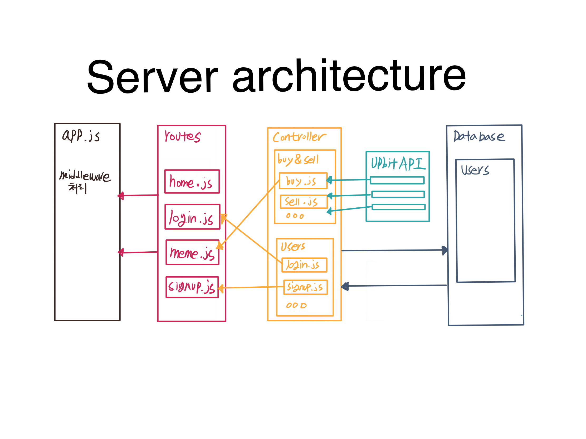
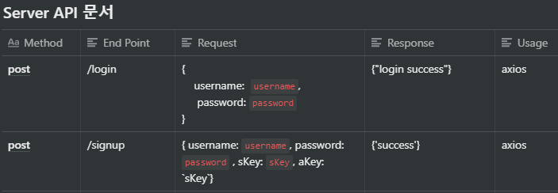

# Tradingbot Project

This project is made for cryptocurency trading. It allows the users to use certain functions that are not provided by cryptocurrency exchanges such as stop limit, auto trading, and etc.

## Installation
Use the Node package manager 'npm' to install the Tradingbot Project

`npm install`

## Stack
•	Node.js – JavaScript runtime

•	Express - Node.js web application framework

•	Sequelize- Promise-based Node.js ORM

•	Amazon AWS- Cloud computing services

## Server Architect
Server API

## API
Server API

## GIF Example

## Authors

•	Jungsoo Kim

•	Hyunggyu Seo

## Contributors
•	Sunken Cho

•	Hyungken Cho

## License
Custard is a free software, and may be the distributed under the terms special in the LICENSE file.